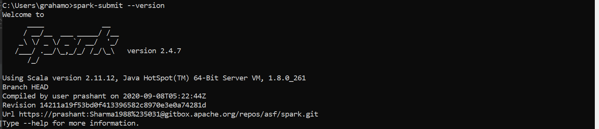
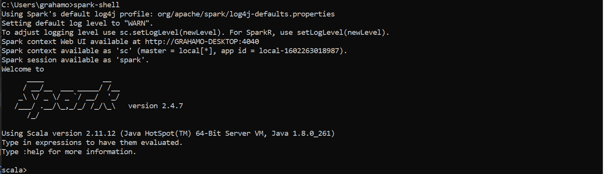

# Java Spark Job
[grahamo-java-example README.md](../README.md)
## Setup Spark On Windows
1. Download latest Java SE Development Kit from https://www.oracle.com/ca-en/java/technologies/javase/javase-jdk8-downloads.html
2. Download Spark 2.4.7 from https://spark.apache.org/downloads.html
3. Download Hadoop winutils from https://github.com/steveloughran/winutils
4. Download the scala windows msi from https://www.scala-lang.org/download/
5. Install the Java Dev Kit from step 1
6. At a cmd prompt type java -version you should see: java version "1.8.0_261"
7. Extract the spark file from step 2 and put at this directory C:\BigDataDev\spark\spark-2.4.7-bin-hadoop2.7
8. Extract the file from step 3 go into hadoop-2.7.1 and copy the bin folder put it at C:\BigDataDev\spark\hadoop\bin
9. Run the scala msi from step 4 and install it to C:\BigDataDev\spark\scala
10. Add the following user variable: HADOOP_HOME = C:\BigDataDev\spark\hadoop
11. Add the following user variable: JAVA_HOME = C:\Program Files\Java\jdk1.8.0_261
12. Add the following user variable: SCALA_HOME = C:\BigDataDev\spark\scala\bin
13. Add the following user variable: SPARK_HOME = C:\BigDataDev\spark\spark-2.4.7-bin-hadoop2.7
14. Add the following to the path variable under user variables C:\BigDataDev\spark\spark-2.4.7-bin-hadoop2.7\bin
15. Add the following to the path variable under user variables C:\BigDataDev\spark\hadoop\bin
16, Add the following to the path variable %JAVA_HOME%\bin
17. At a command prompt try spark-submit --version

18. At a command prompt try spark-shell
